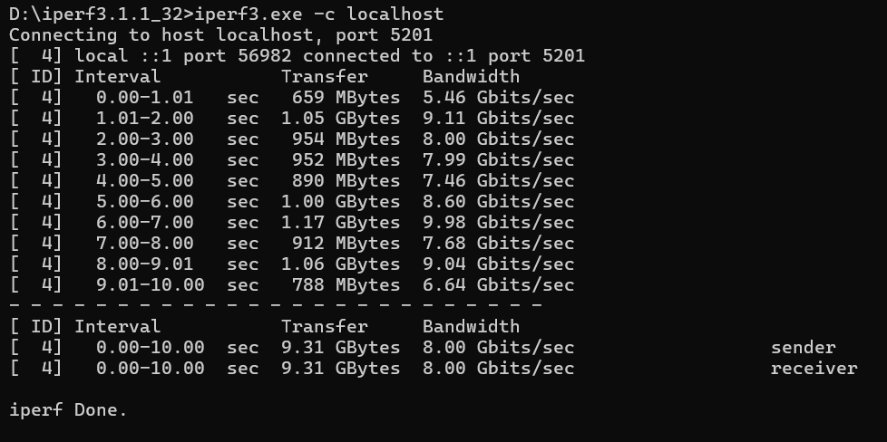

# Using Iperf tool to measure Bandwidth and Jitter

## 1. Installing Iperf

```
sudo apt install iperf

```

## 2.Running a topology
```
sudo mn --topo single,2 --controller=remote,ip=127.0.0.1

```

### Here we are demonstrating iperf between two hosts.

## 3. Now get the cli of a host
```
mininet> xterm h1
mininet> xterm h2
```

We get separate CLI window for both Hosts

## 4. Now in Host 1 (h1) Making it as a Server

```
iperf -s -u
```

## 4. Now in Host 2 (h2) Making it as a Client

```
iperf -c h1 -u -b 10M -t 5
```


- **-u** → use UDP

- **-b** 10M → bandwidth target (10 Mbps)

- **-t** 5 → test duration (5 seconds)

