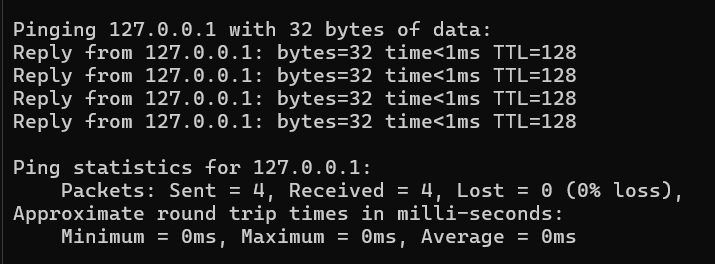

# Using Ping tool to measure Delay

## 1.Running a topology
```
sudo mn --topo single,2 --controller=remote,ip=127.0.0.1

```

### Here we are demonstrating ping between two hosts.

## 2. Now get the cli of a host
```
mininet> xterm h1
mininet> xterm h2
```

We get separate CLI window for both Hosts

## 3. Now in Host 1 (h1) Making it as a Server

```
ping 10.0.0.2
```


**Example ping Result**

